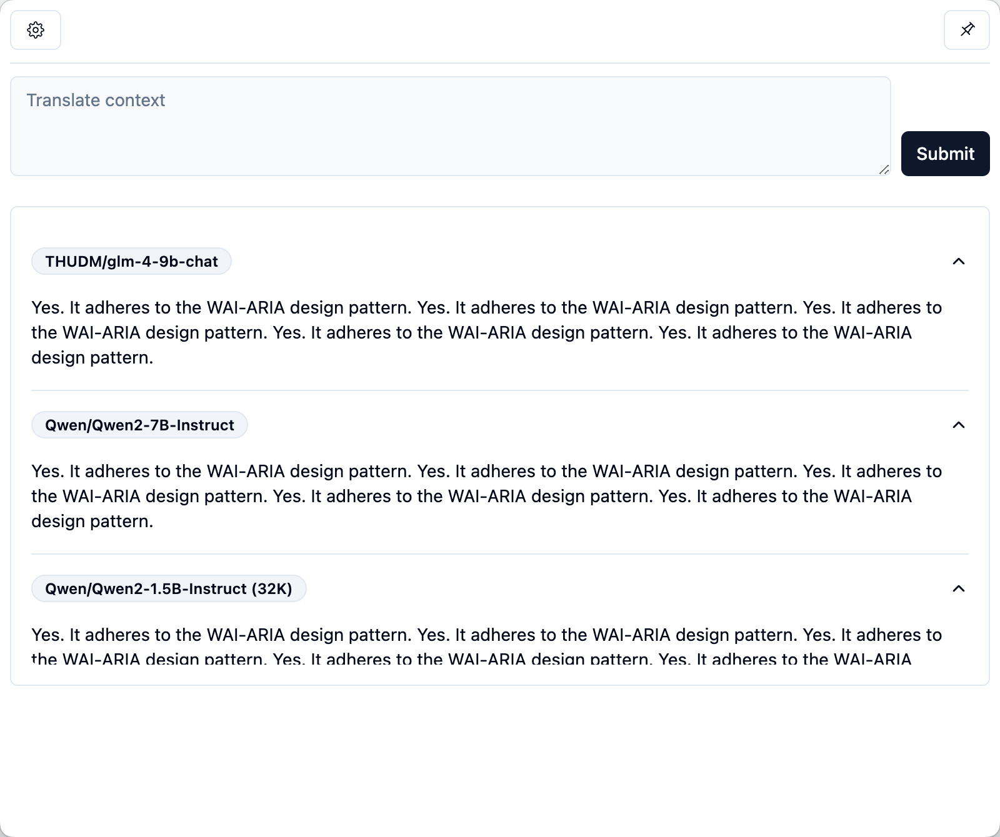

# electron-app

> Demo of te-app(translate english app)


## ScreenShot



## Usages

### macOS

macOS can not open after installed, execute the command below then run again

```shell
sudo xattr -r -d com.apple.quarantine /Applications/te-app.app
```

### Linux

Update ubuntu desktop icon manually

```shell
# sudo update-desktop-database
sudo gtk-update-icon-cache /usr/share/icons/hicolor
sudo update-icon-caches /usr/share/icons/hicolor
sudo update-desktop-database /usr/share/applications
```

### Windows

Can not run after installed, bacause of `robotjs`

```shell
pnpm install

npm rebuild

pnpm install

pnpm build:win
```


## Build

Linux install required dependencies

```shell
sudo apt update && sudo apt install -y libx11-dev libxtst-dev libc6 libstdc++6 build-essential libpng-dev
```

Install dependencies

```shell
pnpm install
```

Re-build robotjs

```shell
npm rebuild
```

Do build

```shell
pnpm build:linux
pnpm build:win
pnpm build:mac
```

> No icon show in Linux?
> Add more resolution icon under `build` folder, 256x256/512x512/1024x1024... then build again


## TODO
- [x] api quetsion tooltip
- [x] add `translating` status
- [x] use StreamEvent
- [x] custom prompt support
- [x] swict source and target language
- [x] selected text listening
- [x] add shortcut key: `CmdOrCtrl+G` show window, `CmdOrCtrl+Esc` hide window


## Reference

- https://github.com/openai/openai-node

- https://www.builder.io/blog/stream-ai-javascript

- https://stackoverflow.com/questions/73547502/how-do-i-stream-openais-completion-api